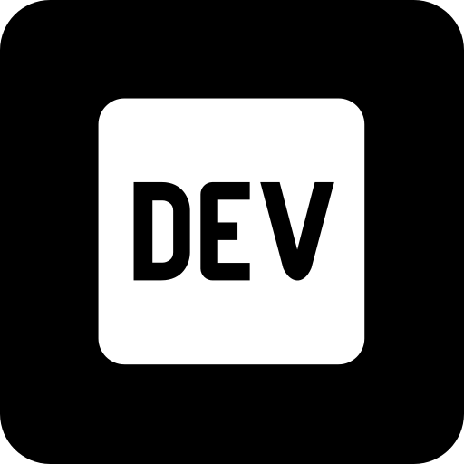

    

<!--Night Owl image-->

  

<!--Header Name-->
# Hii! ɪ'ᴠʜᴀʀꜱʜᴀᴠᴀʀᴅʜᴀɴᴀ! 
*Digital Craftsman (Developer / Programmer)*
  

<!--Start Intro-->               

Hey there! I'm driven by the power of **technology to solve real-world problems** and am constantly exploring new tools and frameworks.

- 🌱 I’m currently working on MERN, I believe that everyday is a learning opportunity.
- 💁‍♂️ Member at [DEV Community](https://dev.to)
- 💻 Visit my [Portfolio](https://dev.to) for more details about me.
- 📚 Always looking to **expand my knowledge base**, explore **open-source projects**, and collaborate with **like-minded tech enthusiasts**.
<!--End Intro-->

<!--Languages and Tools Section-->       
<h2 align="center">Tᴇᴄʜ sᴛᴀᴄᴋ</h2> 
<picture>
  <source media="(prefers-color-scheme: dark)" srcset="./Skills_Animation_Dark.gif">
  <source media="(prefers-color-scheme: light)" srcset="./Skills_Animation_White.gif">
  
</picture>
 

<h3 align="left">Current Learning</h3>
<ul align="left">
  <li>MERN</li>
  <li>Working with LLMs</li>
  <li>Improving my skills in various tools.</li>
</ul>
 
 
 
 

<table width="100%">
  <tr>
    <td width="50%">
      <h3 align="center"><strong>Gɪᴛʜᴜʙ Sᴛᴀᴛs</strong></h3>
      

        
      

    </td>
    <td width="50%">
      <h3 align="center"><strong>Sᴛʀᴇᴀᴋ Sᴛᴀᴛs</strong></h3>
      

        
      

    </td>
  </tr>
 
</table>
 

<!--Contribution Graph-->
<h2 align="center">📈 Cᴏɴᴛʀɪʙᴜᴛɪᴏɴ Gʀᴀᴘʜ 📈</h2>

    

---

<!--Dynamic Quote card updates everyday at 12 PM--> 
<h2 align="center">🌟 Tʜᴏᴜɢʜᴛ ᴏғ ᴛʜᴇ Dᴀʏ 🌟</h2>

<!--STARTS_HERE_QUOTE_CARD-->

    

<!--ENDS_HERE_QUOTE_CARD-->

<!--Contact Section--> 

<h2 align="center">🤝 Cᴏɴɴᴇᴄᴛ Wɪᴛʜ Mᴇ 🤝 </h2>

  

 

<!--Footer--> 

  

